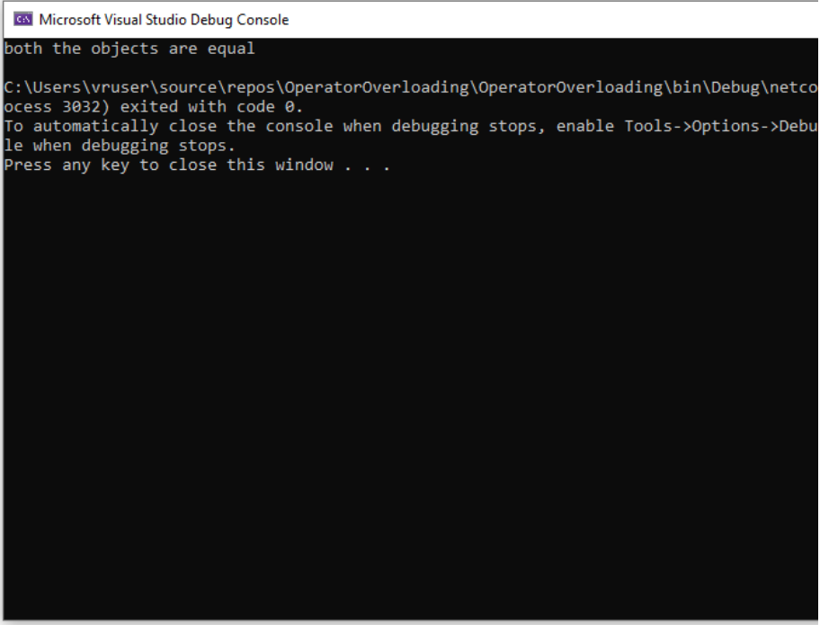

### EX NO : 06
# <p align="center">Operator-Overloading</p>


## Aim:
To write a C# program to pass values through constructors and overload equal operators by checking whether objects are equal using operator overloading. 
 
## Algorithm:
### Step1:
Create a class named program.
### Step 2:
Create two constructors with different arguments to implement operator overloading
### Step 3:
Create boolean operators to check equals and not equal condition and to implement operator overloading.
### Step 4:
Create a Main function
### Step 5:
Create two objects. One without arguments & the other with arguments
### Step 6:
Check whether the objects are equal or not using if-else condition
 
 
## Program:
 
```c#
using System;

namespace OperatorOverloading
{
   class Program
   {
       public int p1, p2;
       
       public Program()
       {
           p1 = 10;
           p2 = 15;
       }
       public Program(int p3, int p4)
       {
           p1 = p3;
           p2 = p4;
       }
       public static bool operator == (Program p1, Program p2)
       {
           return p1.Equals(p2);
       }
       public static bool operator != (Program p1, Program p2)
       {
           return !(p1 == p2);
       }
       public override bool Equals(object obj)
       {
           if (obj == null || GetType() != obj.GetType())
               return false;

           Program other = (Program)obj;
           return p1 == other.p1 && p2 == other.p2;
       }
       public override int GetHashCode()
       {
           return HashCode.Combine(p1, p2);
       }
       public static void Main()
       {
           Program o1 = new Program();
           Program o2 = new Program(10, 15);

           Console.WriteLine("Object P1: {0} {1}", o1.p1, o1.p2);
           Console.WriteLine("Object P2: {0} {1}", o2.p1, o2.p2);

           if (o1 == o2)
               Console.WriteLine("Objects are equal");
           else if (o1 != o2)
               Console.WriteLine("Objects are not equal");
       }
   }
}


 ```

 
## Output:


 
## Result:
C# program to find the volume of a box using operator overloading is implemented successfully.
